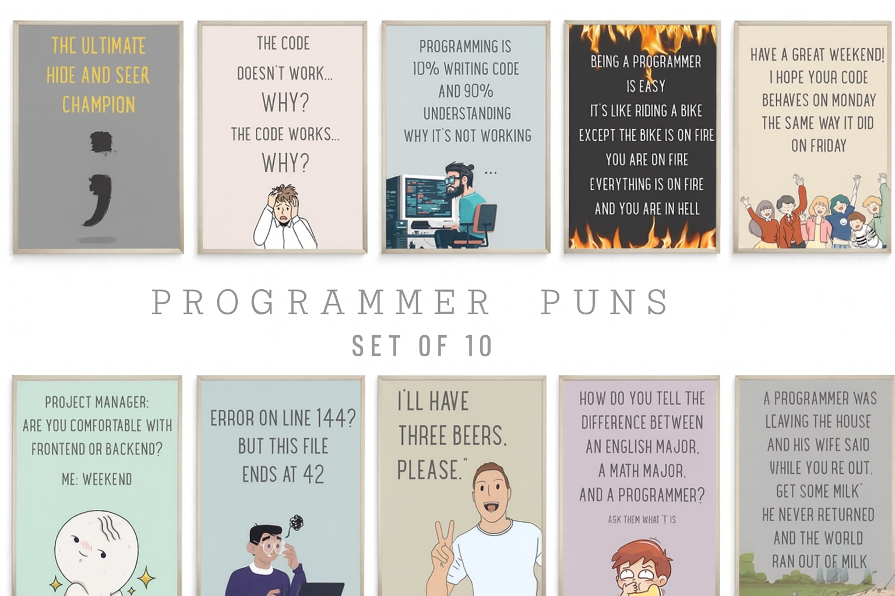

  

###
- 🔭 I’m currently working on **Building projects with Angular and strengthening my base to land my first job as a Frontend Developer**  
- 🌱 I’m currently learning **Full-stack, and deepening my knowledge of Angular, JavaScript, and TypeScript**  
- 💬 Ask me about **Angular, JavaScript, and frontend development**  
- 📫 How to reach me **vishwa.r.ramesh@gmail.com**

###

###
<h3 align="left">🛠 Tech Stack</h3>

   
   
   
   
   
   
   
  

###
<h3 align="left">🌐 Connect with me</h3>

  
  

###
<h3 align="left">📊 GitHub Stats</h3>

  
  

  

  

